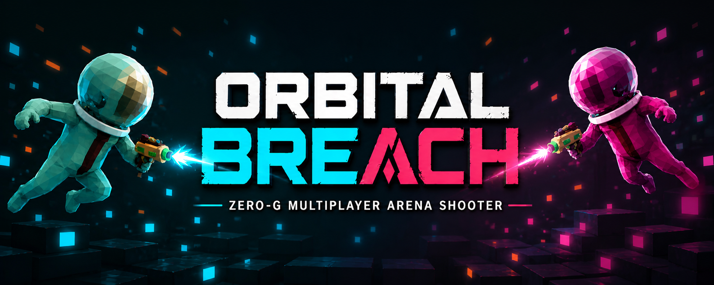

# Orbital Breach

**Vibe Jam 2026 submission.** A zero-gravity team shooter about freezing the enemy squad, slingshotting through a debris arena, and physically breaching the opposing portal before they recover their formation.

[Play Orbital Breach](https://orbital-breach.vercel.app) | [Itch.io](https://dotanv.itch.io) | [Source](https://github.com/DotanVG/Orbital-Breach)

Orbital Breach runs in the browser with no account or install. The game supports solo bot matches, online multiplayer rooms, mobile touch controls, Vibe Jam portal handoff, debrief stats, credits, Vercel Analytics, and Vercel Speed Insights.

## The Match

Two teams, **Team Cyan** and **Team Magenta**, spawn in opposite breach rooms around a zero-G arena. Each round begins from gravity, then players jump, grab rails, charge a launch, and drift through the arena.

The freeze pistol disables enemies for the rest of the round. Limb hits matter: a damaged right arm blocks firing, damaged legs reduce launch power, and a full freeze strands the pilot. A round is won in one of two independent ways:

- **Breach** — a non-frozen player crosses into the enemy breach room through the open portal volume.
- **Full freeze** — every member of the enemy team is frozen at the same time.

Portal doors open at the start of every round, so the breach path is live from the first second — freezing the enemy team is not a prerequisite for breaching, it is its own win condition. Matches are first team to 5 round wins. Rounds have a 120-second hard cap and the online server runs authoritative match state at 20 Hz.

## Playlists

Solo and online share the same team sizes, with mode-specific labels in the UI:

| Team size | Online playlist | Solo menu label | Players |
| --- | --- | --- | --- |
| 1v1 | 1v1 Duel | 1v1 Skirmish | 2 |
| 2v2 | 2v2 Duos | 2v2 Duos | 4 |
| 5v5 | 5v5 Squads | 5v5 Squad Clash | 10 |
| 10v10 | 10v10 Rush | 10v10 Arena Rush | 20 |
| 20v20 | 20v20 War | 20v20 Zero-G War | 40 |

Solo fills every empty seat with AI pilots. Online rooms can be played human-only or filled with bots from the lobby.

## Multiplayer

The main menu has two online entry points:

- **Join Online** starts quick matchmaking with a standard `orbital_lobby` room.
- **Rooms & Invites** opens the server browser for public custom rooms, private/public room creation, invite detection, and direct joins.

Room creation supports:

- Public or private visibility.
- Custom room names up to 24 characters.
- Max player caps derived from the playlist sizes: 2, 4, 10, 20, or 40.
- Shareable invite URLs using the `roomId` query parameter.
- Copy/share buttons and a QR code for joining the exact room.

The online lobby shows:

- Current phase: `Lobby Open`, `Ready Check`, `Round Live`, or `Round Complete`.
- Room name, room id, playlist, round number, and score.
- Team Cyan and Team Magenta rosters with friendly/hostile labels.
- Human and bot seats, ready state, disconnected state, and your own pilot highlight.
- Controls for **Ready Check**, **Move To Cyan/Magenta**, **Fill Lobby**, **Humans Only**, **Settings**, and **Main Menu**.

The countdown starts when each connected human is ready and both teams are filled. Bots can fill open seats immediately, and a later human join reclaims a bot seat instead of overfilling the lobby.

## Controls

| Input | Action |
| --- | --- |
| Mouse | Look around |
| WASD | Walk inside breach rooms |
| E | Grab or release a rail |
| Space | Jump in breach rooms |
| Hold Space while grabbing | Charge launch |
| Mouse movement while charging | Aim launch power |
| Left mouse button | Fire freeze pistol |
| V | Toggle first-person / third-person view |
| B | Hold selfie / look-back view |
| Tab | Hold combat roster / scoreboard |
| Esc | Session menu / release cursor |
| H | Help overlay |

On touch devices, Orbital Breach swaps in mobile controls: a movement joystick in gravity, a look area in zero-G, GRAB, JUMP/LAUNCH, FIRE, and a 1ST/3RD camera toggle.

## Player-Facing Features

- Tutorial mode: an empty arena, bots off, and first-flight guidance.
- Main menu call signs with profanity filtering and local persistence.
- Zero-G rail launch movement with power meter and hit-zone penalties.
- Third-person camera with wall clipping protection.
- Tab scoreboard with team rosters, bot badges, frozen status, and ping columns online.
- Session menu with settings, credits, and safe online exit flows.
- Post-match debrief with final score, pilot stats, and awards.
- Winning-team victory dance animation at match end.
- Credits screen and external project links.
- Vibe Jam portal integration at `https://vibej.am/portal/2026`, including return portals for portal arrivals.
- Landing attribution via Vercel Web Analytics and performance collection via Vercel Speed Insights.

Debrief awards are generated from match stats:

- **Portal Ace** for the top breach scorer.
- **Deep Freeze** for the top freeze scorer.
- **Iron Pilot** for a human pilot who avoids being frozen.
- **Moon Walker** for the most travel distance.

## Tech Stack

| Layer | Technology |
| --- | --- |
| Renderer | Three.js 0.179 |
| Client | TypeScript 5.9, Vite 7.1 |
| Multiplayer | `@colyseus/sdk` 0.17, `@colyseus/core` 0.17, `@colyseus/ws-transport` 0.17 |
| Server | Node.js 18+ runtime, Express 5.2, TypeScript 5.9 |
| Testing | Vitest suite in `tests/` plus the manual smoke checklist in `docs/TESTING.md` |
| Frontend hosting | Vercel |
| Backend hosting | Render |
| Analytics | Vercel Web Analytics and Speed Insights |

## Local Development

Prerequisites: Node.js 18+ and npm.

Install dependencies:

```bash
npm install
npm install --prefix client
npm install --prefix server
```

The root `npm install` pulls the dev tooling (`concurrently`, `vitest`) used by the repo-root scripts.

Run the full local stack in one terminal:

```bash
npm run dev
```

This uses `concurrently` to start the server and client together. To run each service separately instead:

```bash
# terminal 1
npm run dev --prefix server

# terminal 2
npm run dev --prefix client
```

Open [http://localhost:5173](http://localhost:5173). In development, the Vite server proxies `/matchmake` and `/ws` to the Colyseus server on `localhost:2567`.

Useful commands:

```bash
# repo-root test suite (vitest)
npm test

# client build + typecheck
npm run build --prefix client

# server build
npm run build --prefix server
```

Production online multiplayer requires `VITE_COLYSEUS_ENDPOINT` on the client. The server accepts `PORT`, `CLIENT_ORIGIN`, `PUBLIC_ADDRESS`, and `NODE_ENV`.

## Development Tooling

This repo uses an AI-assisted workflow driven by [Symphony](https://github.com/openai/symphony), [Claude Code](https://docs.anthropic.com/claude-code), and Codex-compatible repo-local skills.

| File / Dir | Purpose |
| --- | --- |
| `WORKFLOW.md` | Symphony orchestration prompt and execution contract: tracker state routing, kickoff steps, validation expectations, PR handoff, and the `origin/staging` sync rules used by the orchestrator |
| `.claude/settings.json` | Shared Claude project settings, plugin wiring, and hooks |
| `.claude/hooks/` | Repository guardrails such as post-edit validation and git-operation safety checks |
| `.claude/skills/` | Repo-local Claude/Codex skills, including graphify and project-specific workflow helpers |
| `.worktreeinclude` | Local-only Claude/Codex files copied into new worktrees when they exist locally |
| `CLAUDE.md` | Project memory: branch strategy, architecture invariants, and testing expectations |

Merge strategy follows the repo's documented branch flow: feature work targets `staging` first, and `staging` is promoted to `main` with a fast-forward sync after validation. The orchestration workflow always rebases or fast-forwards against `origin/staging` before active work.

The combination of Linear (issue tracking) + Symphony (orchestration) + Claude/Codex skills (implementation and verification) lets you assign tasks from any machine and have agents pick them up, branch, implement, and open PRs without a separate local planning layer.

### Knowledge Graph

`graphify-out/` is a local-only, gitignored knowledge graph for the codebase. Claude/Codex picks it up through `.claude/skills/graphify/SKILL.md`, so AI sessions can query the graph without extra setup.

Regenerate it after major refactors or any large structural update:

```bash
graphify extract . --backend ollama --model llama3
graphify cluster-only .
```

## Repository Map

- `client/src/game/` contains the runtime shell: `gameApp.ts`, round flow, projectile handling, portal handoff, overlays, and debrief routing.
- `client/src/match/` contains solo authority, online reconciliation, roster shaping, bots, and match adapters.
- `client/src/player/` contains local-player movement, animation, combat, spawn helpers, and third-person presentation.
- `client/src/arena/` contains procedural arena layout, breach-room queries, portal barriers, and obstacle collision helpers.
- `client/src/render/` contains the Three.js scene manager, HUD renderers, materials, and player-facing overlays.
- `client/src/ui/` contains the DOM UI stack: menu, welcome flow, room browser, multiplayer lobby, mobile controls, session menu, credits, instructions, and debrief.
- `client/src/net/` contains Colyseus client wiring, endpoint resolution, room-directory polling, reconciliation helpers, and backend wake-up support.
- `client/src/audio/` and `client/src/analytics/` contain sound playback and Vercel analytics wrappers.
- `server/src/colyseus/` contains the production multiplayer runtime: authoritative room lifecycle, state schema, damage handling, and room directory.
- `server/src/index.ts` bootstraps Express, Colyseus transport, CORS/security middleware, and the `/health`, `/wake`, and `/rooms` endpoints.
- `server/src/net/`, `server/src/room.ts`, and `server/src/sim.ts` retain the legacy WebSocket transport/test harness that is still referenced by parts of the test suite.
- `shared/` contains match constants, arena generation, multiplayer contracts, profanity filtering, hit logic, and shared schemas reused by client and server.
- `docs/` contains the long-form architecture and testing references used to keep README detail concise.
- `tests/` contains the Vitest coverage for gameplay rules, arena generation, online reconciliation, UI helpers, portal placement, analytics, debrief stats, and regressions.
- `.claude/`, `CLAUDE.md`, `WORKFLOW.md`, and `.worktreeinclude` contain the repo-local AI workflow configuration.

## Current Codebase Coverage

Shipped and implemented in the current `staging` tree:

- Browser-playable zero-G FPS with solo bot matches and Colyseus-backed online multiplayer.
- Quick match, room browser, private/public room creation, invite URLs, native share, and QR joins.
- Mobile touch controls, embed support for itch.io, and Vibe Jam portal handoff/return flow.
- Post-match debrief stats, awards, credits, analytics, and Speed Insights instrumentation.
- AI bot fill, ready checks, stale-player seat cleanup, and authoritative round/match scoring.

Evidence-backed pending or transitional surfaces still visible in the repo:

- `client/src/combat.ts` still carries a TODO to route firing through an active-weapon abstraction instead of the current fixed freeze-pistol path.
- `server/src/net/`, `server/src/room.ts`, and `server/src/sim.ts` remain as legacy transport/test support while Colyseus is the production multiplayer path.

## Credits

Audio by **Noam Ouzana**: main theme, hit SFX, laser shots, and countdown audio.
[soundcloud.com/ouzana](https://soundcloud.com/ouzana)

3D assets by **Quaternius**:

- Animated Alien: `Alien.glb` and `Alien_Helmet.glb` for player and bot character rigs.
  [quaternius.com/packs/animatedalien.html](https://quaternius.com/packs/animatedalien.html)
- Sci-Fi Gun Pack: `Ray Gun.glb` for the first-person and third-person freeze pistol.
  [quaternius.com/packs/scifigun.html](https://quaternius.com/packs/scifigun.html)

## More Docs

- [Architecture](docs/ARCHITECTURE.md)
- [Testing](docs/TESTING.md)
